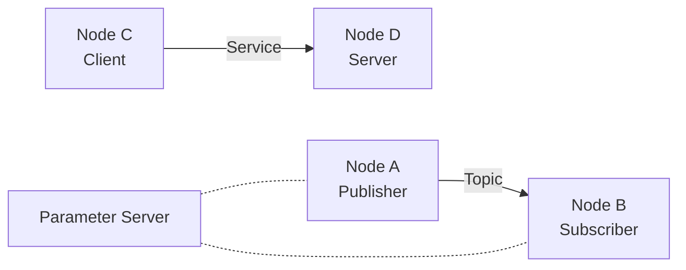

# ROS1 (Noetic)

> ROS1 工作空间、节点通信、常用命令与调试工具速查。

---

## 1. 安装与环境配置

```bash
# Ubuntu 20.04 安装 ROS Noetic（完整桌面版）
sudo sh -c 'echo "deb http://packages.ros.org/ros/ubuntu focal main" > /etc/apt/sources.list.d/ros-latest.list'
sudo apt-key adv --keyserver 'hkp://keyserver.ubuntu.com:80' --recv-key C1CF6E31E6BADE8868B172B4F42ED6FBAB17C654
sudo apt update
sudo apt install ros-noetic-desktop-full

# 环境变量
echo "source /opt/ros/noetic/setup.bash" >> ~/.bashrc
source ~/.bashrc

# 常用依赖
sudo apt install python3-rosdep python3-rosinstall python3-rosinstall-generator python3-wstool build-essential
sudo rosdep init
rosdep update
```

---

## 2. 工作空间（catkin）

### 目录结构

```
catkin_ws/
├── src/                    # 源码空间（放功能包）
│   ├── CMakeLists.txt      # 顶层 cmake（自动生成，勿改）
│   └── my_pkg/
│       ├── CMakeLists.txt  # 功能包构建配置
│       ├── package.xml     # 功能包描述文件
│       ├── src/            # C++ 源码
│       ├── scripts/        # Python 脚本
│       ├── launch/         # launch 文件
│       ├── msg/            # 自定义消息
│       ├── srv/            # 自定义服务
│       └── config/         # 参数配置文件
├── build/                  # 编译中间文件
├── devel/                  # 编译产物（setup.bash 在此）
└── logs/                   # 日志
```

### 常用操作

```bash
# 创建工作空间
mkdir -p ~/catkin_ws/src
cd ~/catkin_ws
catkin_make                              # 首次编译初始化
source devel/setup.bash

# 创建功能包
cd src/
catkin_create_pkg my_pkg std_msgs rospy roscpp

# 编译
cd ~/catkin_ws
catkin_make                              # 编译所有包
catkin_make --pkg my_pkg                 # 只编译指定包
catkin_make clean                        # 清理编译
```

---

## 3. 节点与通信

### 核心概念



| 概念 | 说明 |
| :--- | :--- |
| **Node** | 最小执行单元，一个进程 |
| **Topic** | 异步消息通道（发布/订阅模式） |
| **Service** | 同步请求/响应（客户端/服务端模式） |
| **Action** | 异步带反馈的长任务 |
| **Parameter** | 全局参数服务器，存储配置参数 |
| **Master** | `roscore`，所有节点的注册中心 |

---

## 4. 常用命令

### 启动与运行

```bash
roscore                                  # 启动 ROS Master（必须先启动）
rosrun <pkg> <node>                      # 运行单个节点
roslaunch <pkg> <file.launch>            # 用 launch 文件启动多个节点
```

### 节点管理

```bash
rosnode list                             # 列出所有活跃节点
rosnode info /node_name                  # 查看节点详细信息
rosnode ping /node_name                  # 测试节点连通性
rosnode kill /node_name                  # 终止节点
```

### Topic 相关

```bash
rostopic list                            # 列出所有 topic
rostopic info /topic_name                # 查看 topic 的发布者/订阅者
rostopic echo /topic_name                # 实时打印消息内容
rostopic hz /topic_name                  # 查看发布频率
rostopic pub /topic_name std_msgs/String "data: 'hello'"   # 手动发布消息
rostopic type /topic_name                # 查看消息类型
```

### Service 相关

```bash
rosservice list                          # 列出所有服务
rosservice info /service_name            # 查看服务信息
rosservice call /service_name "{...}"    # 调用服务
rossrv show <srv_type>                   # 查看 srv 定义
```

### 消息类型

```bash
rosmsg list                              # 列出所有消息类型
rosmsg show std_msgs/Header              # 查看消息结构
rosmsg show geometry_msgs/Twist          # 常用：线速度 + 角速度
```

### 参数服务器

```bash
rosparam list                            # 列出所有参数
rosparam get /param_name                 # 获取参数值
rosparam set /param_name value           # 设置参数
rosparam load config.yaml                # 从 YAML 加载参数
rosparam dump params.yaml                # 导出所有参数到文件
```

### 功能包管理

```bash
rospack list                             # 列出所有功能包
rospack find <pkg>                       # 查找功能包路径
roscd <pkg>                              # 跳转到功能包目录
rosls <pkg>                              # 列出功能包内容
rosdep install --from-paths src --ignore-src -r -y   # 安装所有依赖
```

---

## 5. 调试与可视化工具

| 工具 | 命令 | 用途 |
| :--- | :--- | :--- |
| **RViz** | `rosrun rviz rviz` | 3D 可视化（TF、点云、路径等） |
| **rqt_graph** | `rosrun rqt_graph rqt_graph` | 查看节点-话题连接关系图 |
| **rqt_plot** | `rosrun rqt_plot rqt_plot` | 实时数据曲线绘图 |
| **rqt_console** | `rosrun rqt_console rqt_console` | 日志查看器 |
| **rqt_tf_tree** | `rosrun rqt_tf_tree rqt_tf_tree` | TF 坐标系树 |
| **rosbag** | 见下方 | 录制/回放数据 |

### rosbag 录制与回放

```bash
rosbag record -a                         # 录制所有 topic
rosbag record /topic1 /topic2 -O data    # 录制指定 topic，输出 data.bag
rosbag info data.bag                     # 查看 bag 文件信息
rosbag play data.bag                     # 回放
rosbag play data.bag -r 2                # 2 倍速回放
rosbag play data.bag --clock             # 回放并发布仿真时钟
```

---

## 6. TF 坐标变换

```bash
rosrun tf tf_echo /base_link /camera     # 查看两个坐标系变换
rosrun tf view_frames                    # 生成 TF 树 PDF
rosrun tf tf_monitor                     # 实时监控 TF 发布状态
```

---

## 7. Launch 文件示例

```xml title="launch/demo.launch"
<launch>
  <!-- 参数 -->
  <arg name="use_sim" default="true"/>
  <param name="robot_name" value="my_robot"/>

  <!-- 加载 YAML 参数 -->
  <rosparam file="$(find my_pkg)/config/params.yaml" command="load"/>

  <!-- 启动节点 -->
  <node pkg="my_pkg" type="talker.py" name="talker" output="screen"/>
  <node pkg="my_pkg" type="listener.py" name="listener" output="screen"/>

  <!-- 条件启动 -->
  <group if="$(arg use_sim)">
    <include file="$(find gazebo_ros)/launch/empty_world.launch"/>
  </group>
</launch>
```