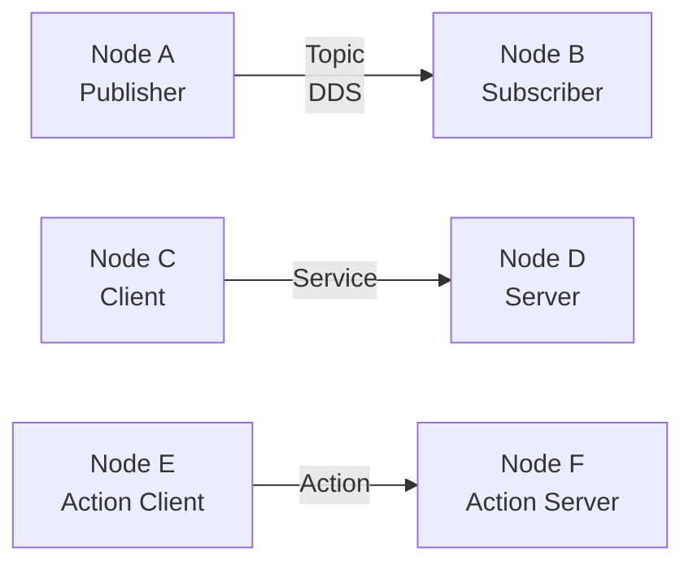

# ROS2 (Humble / Jazzy)

> ROS2 工作空间、节点通信、常用命令与调试工具速查。

---

## 1. 安装与环境配置

```bash
# Ubuntu 22.04 安装 ROS2 Humble
sudo apt install software-properties-common
sudo add-apt-repository universe
sudo apt update && sudo apt install curl -y
sudo curl -sSL https://raw.githubusercontent.com/ros/rosdistro/master/ros.key \
  -o /usr/share/keyrings/ros-archive-keyring.gpg
echo "deb [arch=$(dpkg --print-architecture) signed-by=/usr/share/keyrings/ros-archive-keyring.gpg] \
  http://packages.ros.org/ros2/ubuntu $(. /etc/os-release && echo $UBUNTU_CODENAME) main" | \
  sudo tee /etc/apt/sources.list.d/ros2.list > /dev/null
sudo apt update
sudo apt install ros-humble-desktop

# 环境变量
echo "source /opt/ros/humble/setup.bash" >> ~/.bashrc
source ~/.bashrc

# colcon 构建工具 & 自动补全
sudo apt install python3-colcon-common-extensions
echo "source /usr/share/colcon_argcomplete/hook/colcon-argcomplete.bash" >> ~/.bashrc
```

---

## 2. 工作空间（colcon）

### 目录结构

```
colcon_ws/
├── src/                         # 源码空间
│   └── my_pkg/
│       ├── package.xml          # 功能包描述
│       ├── setup.py             # Python 包（ament_python）
│       ├── CMakeLists.txt       # C++ 包（ament_cmake）
│       ├── my_pkg/              # Python 模块目录
│       │   └── __init__.py
│       ├── launch/              # launch 文件
│       ├── config/              # 参数文件
│       ├── msg/                 # 自定义消息
│       ├── srv/                 # 自定义服务
│       └── action/              # 自定义动作
├── build/                       # 编译中间文件
├── install/                     # 安装产物（setup.bash 在此）
└── log/                         # 日志
```

### 常用操作

```bash
# 创建工作空间
mkdir -p ~/colcon_ws/src
cd ~/colcon_ws
colcon build                             # 编译所有包
source install/setup.bash

# 创建功能包
cd src/
ros2 pkg create my_pkg --build-type ament_python --dependencies rclpy std_msgs
ros2 pkg create my_cpp_pkg --build-type ament_cmake --dependencies rclcpp std_msgs

# 编译选项
colcon build                             # 编译所有
colcon build --packages-select my_pkg    # 只编译指定包
colcon build --symlink-install           # 符号链接安装（Python 改代码无需重新编译）
colcon build --cmake-args -DCMAKE_BUILD_TYPE=Release   # Release 模式
```

!!! tip "推荐别名"
    ```bash
    echo "alias cb='cd ~/colcon_ws && colcon build --symlink-install && source install/setup.bash'" >> ~/.bashrc
    ```

---

## 3. 节点与通信

### 核心概念



| 概念 | 说明 | 与 ROS1 对比 |
| :--- | :--- | :--- |
| **Node** | 最小执行单元 | 一个进程可含多个 Node |
| **Topic** | 异步发布/订阅 | 基于 DDS，QoS 可配 |
| **Service** | 同步请求/响应 | 无需 Master |
| **Action** | 异步 + 反馈 + 可取消 | 原生支持 |
| **Parameter** | 节点本地参数（非全局） | 去中心化，无全局参数服务器 |
| **Lifecycle Node** | 有状态管理的节点 | ROS1 无此概念 |

### QoS（服务质量策略）

| 策略 | 说明 |
| :--- | :--- |
| `Reliability` | `RELIABLE`（可靠） / `BEST_EFFORT`（尽力） |
| `Durability` | `TRANSIENT_LOCAL`（保留最后一条给新订阅者） / `VOLATILE` |
| `History` | `KEEP_LAST(N)` / `KEEP_ALL` |
| `Depth` | 队列深度 |

---

## 4. 常用命令

### 启动与运行

```bash
ros2 run <pkg> <executable>              # 运行单个节点
ros2 launch <pkg> <file.launch.py>       # 启动 launch 文件
```

!!! note "ROS2 没有 roscore"
    ROS2 基于 DDS，去中心化架构，**不需要启动 Master**。

### 节点管理

```bash
ros2 node list                           # 列出所有活跃节点
ros2 node info /node_name                # 查看节点详情（topic、service、action）
```

### Topic 相关

```bash
ros2 topic list                          # 列出所有 topic
ros2 topic list -t                       # 列出 topic 及其消息类型
ros2 topic info /topic_name              # 查看发布者/订阅者数量
ros2 topic echo /topic_name              # 实时打印消息
ros2 topic hz /topic_name                # 查看发布频率
ros2 topic bw /topic_name                # 查看带宽
ros2 topic pub /topic_name std_msgs/msg/String "{data: 'hello'}"   # 手动发布
ros2 topic pub /cmd_vel geometry_msgs/msg/Twist \
  "{linear: {x: 0.5}, angular: {z: 0.3}}" -r 10   # 10Hz 持续发布
```

### Service 相关

```bash
ros2 service list                        # 列出所有服务
ros2 service type /service_name          # 查看服务类型
ros2 service call /service_name std_srvs/srv/Empty   # 调用服务
ros2 interface show std_srvs/srv/SetBool # 查看 srv 定义
```

### Action 相关

```bash
ros2 action list                         # 列出所有 action
ros2 action info /action_name            # 查看 action 详情
ros2 action send_goal /action_name <type> "{...}"   # 发送目标
```

### 参数管理

```bash
ros2 param list                          # 列出所有节点的参数
ros2 param list /node_name               # 列出某节点参数
ros2 param get /node_name param_name     # 获取参数值
ros2 param set /node_name param_name value   # 设置参数
ros2 param dump /node_name               # 导出参数到 YAML
ros2 param load /node_name params.yaml   # 从 YAML 加载参数
```

### 消息/接口类型

```bash
ros2 interface list                      # 列出所有 msg/srv/action
ros2 interface show geometry_msgs/msg/Twist       # 查看消息结构
ros2 interface show sensor_msgs/msg/LaserScan     # 激光雷达消息
ros2 interface show nav_msgs/msg/Odometry         # 里程计消息
```

### 功能包管理

```bash
ros2 pkg list                            # 列出所有功能包
ros2 pkg prefix <pkg>                    # 查看包的安装路径
ros2 pkg xml <pkg>                       # 查看 package.xml
rosdep install --from-paths src --ignore-src -r -y   # 安装所有依赖
```

---

## 5. 调试与可视化工具

| 工具 | 命令 | 用途 |
| :--- | :--- | :--- |
| **RViz2** | `ros2 run rviz2 rviz2` | 3D 可视化 |
| **rqt** | `rqt` | 插件式 GUI 工具集 |
| **rqt_graph** | `ros2 run rqt_graph rqt_graph` | 节点-话题关系图 |
| **rqt_plot** | `ros2 run rqt_plot rqt_plot` | 实时数据曲线 |
| **rqt_tf_tree** | `ros2 run rqt_tf_tree rqt_tf_tree` | TF 坐标树 |
| **ros2 bag** | 见下方 | 录制 / 回放数据 |

### ros2 bag 录制与回放

```bash
ros2 bag record -a                       # 录制所有 topic
ros2 bag record /topic1 /topic2 -o my_bag   # 录制指定 topic
ros2 bag info my_bag/                    # 查看 bag 信息
ros2 bag play my_bag/                    # 回放
ros2 bag play my_bag/ -r 2.0            # 2 倍速回放
ros2 bag play my_bag/ --clock 187        # 回放并发布仿真时钟
```

---

## 6. TF2 坐标变换

```bash
ros2 run tf2_ros tf2_echo base_link camera_link          # 查看坐标变换
ros2 run tf2_tools view_frames                           # 生成 TF 树 PDF
ros2 run tf2_ros tf2_monitor                             # 实时监控 TF
ros2 run tf2_ros static_transform_publisher \
  0.1 0.0 0.2 0 0 0 base_link imu_link                  # 发布静态 TF
```

---

## 7. Launch 文件示例（Python）

```python title="launch/demo.launch.py"
from launch import LaunchDescription
from launch.actions import DeclareLaunchArgument
from launch.substitutions import LaunchConfiguration
from launch_ros.actions import Node

def generate_launch_description():
    return LaunchDescription([
        # 声明参数
        DeclareLaunchArgument('use_sim_time', default_value='false'),

        # 启动节点
        Node(
            package='my_pkg',
            executable='talker',
            name='talker',
            output='screen',
            parameters=[{
                'use_sim_time': LaunchConfiguration('use_sim_time'),
            }],
            remappings=[
                ('/cmd_vel', '/robot/cmd_vel'),
            ],
        ),

        Node(
            package='my_pkg',
            executable='listener',
            name='listener',
            output='screen',
        ),
    ])
```

---

## 8. ROS1 → ROS2 命令对照

| 操作 | ROS1 | ROS2 |
| :--- | :--- | :--- |
| 启动 Master | `roscore` | 不需要 |
| 运行节点 | `rosrun pkg node` | `ros2 run pkg node` |
| Launch | `roslaunch pkg f.launch` | `ros2 launch pkg f.launch.py` |
| 话题列表 | `rostopic list` | `ros2 topic list` |
| 打印消息 | `rostopic echo /t` | `ros2 topic echo /t` |
| 创建包 | `catkin_create_pkg` | `ros2 pkg create` |
| 编译 | `catkin_make` | `colcon build` |
| 录制 | `rosbag record` | `ros2 bag record` |
| Source | `source devel/setup.bash` | `source install/setup.bash` |