# :material-pencil-ruler: 笔记操作流程

!!! tip "这是什么"
    这篇文档介绍如何在本站**新建、组织和发布笔记**。  
    写作语法请参考 [写作指南](user.md)。

---

## 1. 目录结构总览

本站的 `docs/` 文件夹按内容板块组织，每个板块对应顶部导航的一个 Tab：

```
docs/
├── index.md                  ← 首页（一般不需要动）
├── Robotics/                 ← 🤖 机器人学
│   ├── index.md              ← 板块首页
│   └── xxx.md                ← 具体笔记
├── AI/                       ← 🧠 人工智能
│   ├── index.md
│   └── python.md
├── Life/                     ← 🌱 生活随笔
│   └── index.md
├── Website/                  ← 🌐 站点相关
│   ├── index.md
│   ├── user.md               ← 写作指南
│   ├── changelog.md          ← 更新记录
│   └── workflow.md           ← 本文档
├── Others/                   ← 📦 其他
│   └── index.md
├── javascripts/              ← JS 资源（不用管）
└── stylesheets/              ← CSS 资源（不用管）
```

!!! warning "注意"
    `javascripts/` 和 `stylesheets/` 是站点功能文件，写笔记时**不要修改**。

---

## 2. 新建一篇笔记

只需两步：**创建文件** → **注册到导航**。

### 第一步：创建 Markdown 文件

在对应板块文件夹下新建 `.md` 文件。文件名建议用**英文小写 + 短横线**，例如：

| 笔记内容 | 文件路径 |
| :--- | :--- |
| SLAM 学习笔记 | `docs/Robotics/slam.md` |
| Transformer 论文阅读 | `docs/AI/transformer.md` |
| 读书笔记 | `docs/Life/reading.md` |
| 某个小工具 | `docs/Others/my-tool.md` |

文件开头直接写标题即可：

```markdown
# SLAM 学习笔记

## 1. 什么是 SLAM

SLAM（Simultaneous Localization and Mapping）是...
```

### 第二步：注册到导航

打开项目根目录的 `mkdocs.yml`，找到底部的 `nav` 部分，在对应板块下添加一行：

```yaml title="mkdocs.yml"
nav:
  - Robotics:
      - Robotics/index.md
      - SLAM笔记: Robotics/slam.md    # (1)!
```

1. 格式为 `显示名称: 文件路径`，路径相对于 `docs/`

!!! success "完成"
    保存 `mkdocs.yml` 后，新笔记就会出现在网站导航中。

---

## 3. 创建子分类

当某个板块笔记变多时，可以建子文件夹进一步分类：

```
docs/AI/
├── index.md
├── python.md
├── deep-learning/           ← 子分类文件夹
│   ├── index.md             ← 子分类首页（必须有）
│   ├── cnn.md
│   └── transformer.md
└── reinforcement-learning/
    ├── index.md
    └── dqn.md
```

对应的 `mkdocs.yml` 写法：

```yaml title="mkdocs.yml"
nav:
  - AI:
      - AI/index.md
      - Python: AI/python.md
      - 深度学习:
          - AI/deep-learning/index.md
          - CNN: AI/deep-learning/cnn.md
          - Transformer: AI/deep-learning/transformer.md
      - 强化学习:
          - AI/reinforcement-learning/index.md
          - DQN: AI/reinforcement-learning/dqn.md
```

!!! info "关于 `index.md`"
    每个子文件夹都建议放一个 `index.md` 作为该分类的概述页。  
    站点配置已开启 `navigation.indexes`，`index.md` 会自动关联为分区标题页。

---

## 4. 发布到网站

本站使用 GitHub Actions 自动部署。你只需要：

```bash
git add .
git commit -m "add: SLAM学习笔记"
git push
```

推送到 `main` 分支后，GitHub Actions 会自动执行：

1. 安装 `mkdocs-material`
2. 运行 `mkdocs gh-deploy --force`
3. 部署到 `https://alannian.github.io/`

!!! tip "部署时间"
    一般推送后 **1-2 分钟** 即可在网站上看到更新。

---

## 5. 本地预览（推荐）

发布前先在本地预览，确认效果没问题：

```bash
# 激活环境
conda activate myblog

# 启动本地服务器
mkdocs serve
```

浏览器打开 `http://127.0.0.1:8000/` 即可实时预览。  
修改文件后页面会**自动刷新**，无需手动重启。

按 ++ctrl+c++ 停止服务器。

---

## 6. 更新记录

每次添加或修改笔记后，建议顺手更新 [更新记录](changelog.md)，记录变更内容。

打开 `docs/Website/changelog.md`，在最新日期下添加条目：

```html
<div class="timeline-item">
  <div class="timeline-date">2026-02-12</div>
  <div class="timeline-card">
    <span class="timeline-tag new-page">NEW</span>
    新增 SLAM 学习笔记
  </div>
</div>
```

可用的标签类型：

| 标签 | 样式类名 | 用途 |
| :--- | :--- | :--- |
| NEW | `new-page` | 新建页面 |
| UPDATE | `page-update` | 更新已有页面 |
| FEATURE | `feature` | 站点新功能 |
| FIX | `fix` | 修复问题 |

---

## 7. 完整操作速查

```mermaid
graph LR
    A[创建 md 文件] --> B[写入内容]
    B --> C[注册到 mkdocs.yml nav]
    C --> D[本地预览 mkdocs serve]
    D --> E{效果满意?}
    E -->|是| F[git add + commit + push]
    E -->|否| B
    F --> G[自动部署上线 🎉]
```



!!! example "举例：添加一篇 SLAM 笔记的完整流程"

    === "1. 创建文件"
        ```
        在 docs/Robotics/ 下新建 slam.md
        ```

    === "2. 写内容"
        ```markdown
        # SLAM 学习笔记
        
        ## 概述
        SLAM 是同时定位与建图的缩写...
        ```

    === "3. 注册导航"
        ```yaml
        # mkdocs.yml 的 nav 部分
        - Robotics:
            - Robotics/index.md
            - SLAM: Robotics/slam.md
        ```

    === "4. 预览 & 发布"
        ```bash
        mkdocs serve          # 本地预览
        git add .
        git commit -m "add: SLAM笔记"
        git push              # 自动部署
        ```
