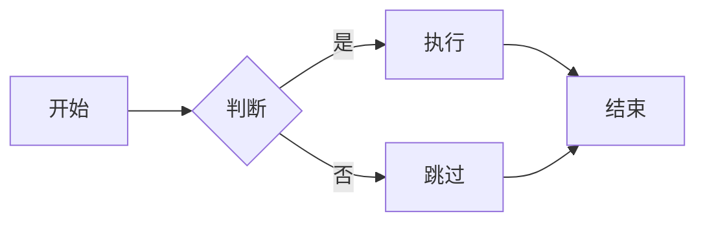
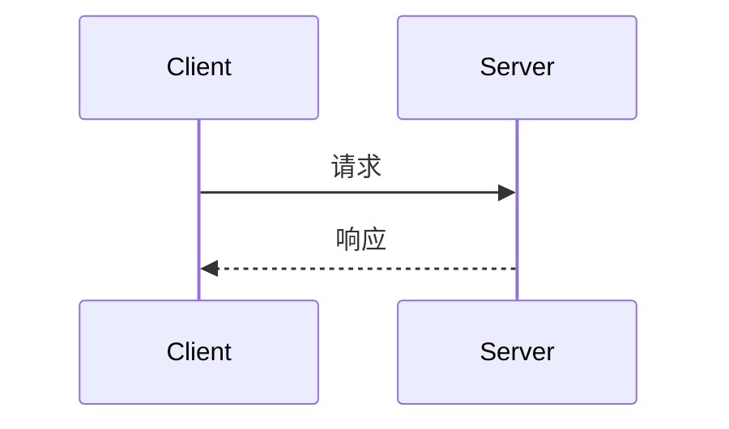

# :material-book-open-variant: 写作指南

!!! tip "这是什么"
    这篇文档列出了你在本站写 Markdown 笔记时**可以使用的所有排版能力**。  
    把它当作一份速查手册，写笔记时随时回来看看。

---

## 1. 提示块（Admonitions）

提示块是最常用的排版工具，用来高亮重要内容。

### 基本语法

```markdown
!!! note "标题（可选）"
    提示块正文内容，需要 **4 空格缩进**。
```

### 所有类型一览

!!! note "note — 笔记/备注"
    适合补充说明性内容。

!!! abstract "abstract — 摘要"
    适合放文章概述或要点总结。

!!! info "info — 信息"
    一般性的信息提示。

!!! tip "tip — 技巧"
    实用的小技巧、最佳实践。

!!! success "success — 成功"
    操作成功、正确示范。

!!! question "question — 问题"
    提出疑问，引导思考。

!!! warning "warning — 警告"
    需要注意避免的问题。

!!! danger "danger — 危险"
    严重问题，可能导致错误。

!!! bug "bug — Bug"
    已知问题或缺陷记录。

!!! example "example — 示例"
    代码或操作示例。

!!! quote "quote — 引用"
    引用名言或他人观点。

### 可折叠提示块

```markdown
??? note "点击展开（默认折叠）"
    隐藏的内容...

???+ note "点击折叠（默认展开）"
    默认显示的内容...
```

??? note "点击展开看看"
    你找到我了！这就是可折叠提示块。

???+ warning "默认展开的警告"
    这个提示块默认是打开的，可以点击标题折叠。

---

## 2. 选项卡（Tabs）

用于在同一位置展示多个平行内容（如不同语言的代码）。

### 语法

```markdown
=== "标签 A"

    标签 A 的内容

=== "标签 B"

    标签 B 的内容
```

### 效果

=== "Python"

    ```python
    print("Hello, World!")
    ```

=== "C++"

    ```cpp
    #include <iostream>
    int main() {
        std::cout << "Hello, World!" << std::endl;
        return 0;
    }
    ```

=== "Rust"

    ```rust
    fn main() {
        println!("Hello, World!");
    }
    ```

---

## 3. 代码块

### 基础代码块

````markdown
```python
print("Hello")
```
````

### 带行号

````markdown
```python linenums="1"
def hello():
    print("Hello")
```
````

```python linenums="1"
def hello():
    print("Hello")
```

### 带标题

````markdown
```python title="main.py"
print("带标题的代码块")
```
````

```python title="main.py"
print("带标题的代码块")
```

### 高亮特定行

````markdown
```python hl_lines="2 3"
def calculate():
    x = 10        # 这行会高亮
    y = x * 2     # 这行也会高亮
    return y
```
````

```python hl_lines="2 3"
def calculate():
    x = 10
    y = x * 2
    return y
```

### 行内代码高亮

```markdown
用 `#!python print("hello")` 这样的语法实现行内高亮。
```

效果：用 `#!python print("hello")` 这样写行内代码会自动高亮。

---

## 4. 图标（Icons）

本站支持使用 Material Design Icons 和 FontAwesome 图标。

### 语法

```markdown
:material-robot:          → 机器人图标
:material-brain:          → 大脑图标
:material-language-python: → Python 图标
:fontawesome-brands-github: → GitHub 图标
:octicons-heart-fill-24:  → 实心爱心
```

### 常用图标速查

| 写法 | 效果 | 用途 |
| :--- | :---: | :--- |
| `:material-robot:` | :material-robot: | 机器人 |
| `:material-brain:` | :material-brain: | AI / 大脑 |
| `:material-language-python:` | :material-language-python: | Python |
| `:material-code-braces:` | :material-code-braces: | 代码 |
| `:material-flask:` | :material-flask: | 实验 |
| `:material-book:` | :material-book: | 书籍 |
| `:material-lightbulb:` | :material-lightbulb: | 想法 |
| `:material-check-circle:` | :material-check-circle: | 完成 |
| `:material-alert:` | :material-alert: | 警告 |
| `:material-link:` | :material-link: | 链接 |
| `:material-download:` | :material-download: | 下载 |
| `:material-pencil:` | :material-pencil: | 编辑 |

!!! tip "查找更多图标"
    完整图标列表请访问：  
    - [Material Design Icons](https://pictogrammers.com/library/mdi/)  
    - [FontAwesome](https://fontawesome.com/icons)  
    - [Octicons](https://primer.style/octicons/)

---

## 5. 数学公式（LaTeX）

### 行内公式

```markdown
质能方程 $E = mc^2$ 是物理学最优美的公式之一。
```

质能方程 $E = mc^2$ 是物理学最优美的公式之一。

### 行间公式

```markdown
$$
\nabla \times \mathbf{E} = -\frac{\partial \mathbf{B}}{\partial t}
$$
```

$$
\nabla \times \mathbf{E} = -\frac{\partial \mathbf{B}}{\partial t}
$$

### 常用公式模板

=== "矩阵"

    ```markdown
    $$
    A = \begin{bmatrix}
    a_{11} & a_{12} \\
    a_{21} & a_{22}
    \end{bmatrix}
    $$
    ```

    $$
    A = \begin{bmatrix}
    a_{11} & a_{12} \\
    a_{21} & a_{22}
    \end{bmatrix}
    $$

=== "求和 & 积分"

    ```markdown
    $$
    \sum_{i=1}^{n} x_i = x_1 + x_2 + \cdots + x_n
    $$

    $$
    \int_{a}^{b} f(x) \, dx
    $$
    ```

    $$
    \sum_{i=1}^{n} x_i = x_1 + x_2 + \cdots + x_n
    $$

    $$
    \int_{a}^{b} f(x) \, dx
    $$

=== "分段函数"

    ```markdown
    $$
    f(x) = \begin{cases}
    x^2   & \text{if } x \geq 0 \\
    -x    & \text{if } x < 0
    \end{cases}
    $$
    ```

    $$
    f(x) = \begin{cases}
    x^2   & \text{if } x \geq 0 \\
    -x    & \text{if } x < 0
    \end{cases}
    $$

---

## 6. Mermaid 图表

### 流程图

````markdown

````


### 时序图

````markdown

````


---

## 7. 表格

### 基础表格

```markdown
| 左对齐 | 居中 | 右对齐 |
| :--- | :---: | ---: |
| 内容 | 内容 | 内容 |
```

| 左对齐 | 居中 | 右对齐 |
| :--- | :---: | ---: |
| Apple | Red | $1.00 |
| Banana | Yellow | $0.50 |

---

## 8. 任务列表

```markdown
- [x] 已完成的任务
- [ ] 待完成的任务
- [ ] 另一个待办事项
```

- [x] 已完成的任务
- [ ] 待完成的任务
- [ ] 另一个待办事项

---

## 9. 定义列表

```markdown
术语一
:   术语一的定义解释。

术语二
:   术语二的定义解释。
    可以包含多行。
```

强化学习
:   一种机器学习范式，智能体通过与环境交互来学习最优策略。

Transformer
:   一种基于自注意力机制的神经网络架构，广泛用于 NLP 和 CV。

---

## 10. 脚注

```markdown
这是一段带脚注的文本[^1]。

[^1]: 这是脚注的内容，会显示在页面底部。
```

这是一段带脚注的文本[^1]。

[^1]: 脚注会自动编号并显示在页面底部。

---

## 11. 按钮

```markdown
[普通按钮](#){ .md-button }
[主要按钮](#){ .md-button .md-button--primary }
```

[普通按钮](#){ .md-button }
[主要按钮](#){ .md-button .md-button--primary }

---

## 12. Grid Cards（卡片网格）

```markdown
<div class="grid cards" markdown>

-   :material-clock: __卡片标题__

    ---

    卡片正文内容

-   :material-star: __另一个卡片__

    ---

    更多内容

</div>
```

<div class="grid cards" markdown>

-   :material-clock: __示例卡片 A__

    ---

    卡片非常适合做板块入口或信息概览。

-   :material-star: __示例卡片 B__

    ---

    悬浮时有上浮动效 ↑

</div>

---

## 13. 文本格式化

| 语法 | 效果 |
| :--- | :--- |
| `**粗体**` | **粗体** |
| `*斜体*` | *斜体* |
| `***粗斜体***` | ***粗斜体*** |
| `~~删除线~~` | ~~删除线~~ |
| `==高亮==` | ==高亮==（需 `pymdownx.mark` 扩展） |
| `H~2~O` | H~2~O（需 `pymdownx.tilde` 扩展） |
| `X^2^` | X^2^（需 `pymdownx.caret` 扩展） |

---

## 14. 链接与图片

### 内部链接

```markdown
[跳转到 Python 笔记](学习笔记/python.md)
[跳转到某个标题](学习笔记/python.md#装饰器decorator)
```

### 外部链接

```markdown
[Google](https://www.google.com)
```

### 图片

```markdown

{ width="300" }
```

---

## 15. 键盘按键

```markdown
按 ++ctrl+c++ 复制，++ctrl+v++ 粘贴。
```

!!! note "需要扩展"
    键盘按键需要启用 `pymdownx.keys` 扩展。  
    如需使用，在 `mkdocs.yml` 的 `markdown_extensions` 中添加：
    ```yaml
    - pymdownx.keys
    ```

---

## 快速参考

| 我想要… | 用什么 |
| :--- | :--- |
| 高亮一段重要提示 | `!!! tip "标题"` |
| 展示多语言代码 | `=== "Python"` 选项卡 |
| 带行号的代码 | ` ```python linenums="1" ` |
| 一键复制代码 | 已全局开启，悬浮代码块右上角 |
| 数学公式 | `$行内$` 或 `$$行间$$` |
| 流程图 | ` ```mermaid ` |
| 折叠长内容 | `??? note "标题"` |
| 漂亮的信息卡片 | `<div class="grid cards">` |
| 图标装饰标题 | `:material-robot:` |
| 待办事项 | `- [x] 已完成` |
